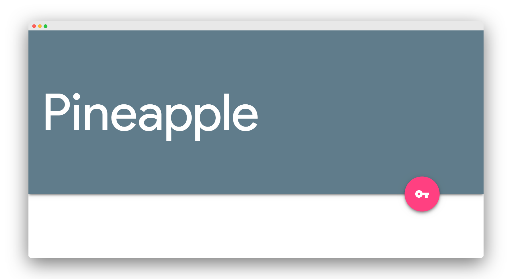

```
When I wrote this, only God and I understood what I was doing. Now, only God knows.
```
<div align="center">
  <a href="https://liyas-thomas.firebaseapp.com"></a>
  <br>
  <h1>Liyas Thomas</h1>
  <sub>Built with ❤︎ by
  <a href="https://github.com/liyasthomas">liyasthomas</a> and
  <a href="https://github.com/liyasthomas/pineapple-notes/graphs/contributors">contributors</a>
	</sub>
</div>

---

[](https://travis-ci.org/liyasthomas/pineapple-notes) [](https://github.com/liyasthomas/pineapple-notes/releases/latest) [](https://github.com/liyasthomas/pineapple-notes/archive/master.zip) [](https://github.com/liyasthomas/pineapple-notes/blob/master/LICENSE) [](https://github.com/liyasthomas/pineapple-notes/issues) [](https://liyas-thomas.firebaseapp.com) [](https://www.paypal.me/liyascthomas)

# 🍍 Pineapple Notes

### A simple, clean note app by [Liyas Thomas](https://github.com/liyasthomas)

<div align="center">
  <br>
  
  <br>
</div>

### Features :sparkles:

:eyeglasses: **Virtual Reality made simple**: Description 1

:heart: **Declarative HTML**: Description 2

:electric_plug: **Entity-Component Architecture**: Description 3

:zap: **Performance**: Description 4

:globe_with_meridians: **Cross-Platform**: Description 5

---

## Demo

[https://pineapple-notes.firebaseapp.com](https://pineapple-notes.firebaseapp.com/)

---

## Built with

* **[Polymer](https://www.polymer-project.org)**
	* [Web components](https://www.webcomponents.org)
* **[Chromium](https://github.com/chromium/chromium)** - Thanks for being so fast!
* HTML - For the web framework
* CSS - For styling components
* JavaScript - For magic!

---

## Contributing

Please read [CONTRIBUTING](CONTRIBUTING.md) for details on our [CODE OF CONDUCT](CODE_OF_CONDUCT.md), and the process for submitting pull requests to us.

---

## Continuous Integration

We use [Travis CI](https://travis-ci.com) for continuous integration. Check out our [Travis CI Status](https://travis-ci.org/liyasthomas/pineapple-notes).

---

## Versioning

This project is developed by [Liyas Thomas](https://github.com/liyasthomas) using the [Semantic Versioning specification](https://semver.org). For the versions available, see the [releases on this repository](https://github.com/liyasthomas/pineapple-notes/releases).

---

## Change log

See the [CHANGELOG](CHANGELOG.md) file for details.

---

## Authors

### Lead Developers
* [**Liyas Thomas**](https://github.com/liyasthomas) - *Author*

### Testing and Debugging
* [Liyas Thomas](https://github.com/liyasthomas)

### Contributors
* [Liyas Thomas](https://github.com/liyasthomas)

### Thanks
* [Google](https://www.google.com) - For [Firebase](https://firebase.google.com)

See the list of [contributors](https://github.com/liyasthomas/pineapple-notes/graphs/contributors) who participated in this project.

---

## License

This project is licensed under the [MIT License](https://opensource.org/licenses/MIT) - see the [LICENSE](LICENSE) file for details.

---

## Acknowledgments

* Hat tip to anyone who's code was used
* Inspirations:
	* [Firebase](https://firebase.google.com)
